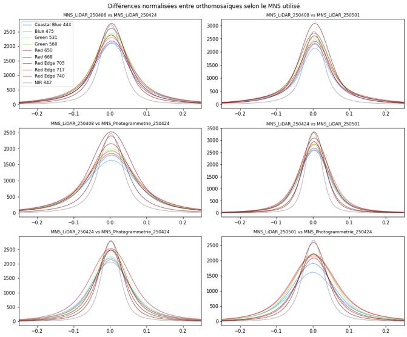

# Comparaison de l'impact de différents MNS sur la réflectance des orthomosaïques 
## Accès rapide
* [Questions](#questions)
* [Méthode](#methode)
* [Résultats](#resultats)
    - [Graphes](#graphes)
    - [Commentaires](#commentaires)
* [Conclusion](#conclusion)
    

## Questions
Afin de produire une orthomosaïque, il est nécessaire d’utiliser un MNS afin de projeter les images sur ce dernier. Les questions suivantes sont donc à considérer :

- Le MNS utilisé change-t-il considérablement l’orthomosaïque ?

- Utiliser un MNS issu du LiDAR augmente-t-il la qualité de l’orthomosaïque en comparaison d’un MNS photogrammétrique ?

- Un MNS LiDAR produit au début de la série temporelle donne-t-il les mêmes résultats qu’un MNS LiDAR produit au milieu ou à la fin de cette dernière (et inversement) ?

## Méthode
Utilisation d’un MNS : 
- LiDAR « hiver » -> 08/04/2025
- LiDAR « fin printemps » -> 01/05/2025
- LiDAR ~ milieu débourrement  -> 24/04/2025
- Photogrammétrique ~milieu débourrement -> 24/04/2025

*Chronologie saison et choix des MNS - 2025*

*BBCH à Lyons*

**Le choix du 24/04/2025 a été fait pour plusieurs raisons** : 
- se situer approximativement entre la fin de la dormance hivernale et la fin du débourrement ;
- être dans des conditions de ciel couvert pour éliminer les effets d’ombre ;
- avoir une orthomosaïque sans trop d’artefacts (l’orthomosaïque du 22/04/2025 présentait par exemple un fort décalage géométrique).

1. Création des MNS : 24/04 et 01/05 produits par Terra et 08/04 avec pdal (traitement Terra n’a jamais réussi à aboutir)

2. Création d’une orthomosaïque à 4 cm/px pour chaque MNS, soit 4 au total ;

3. Rééchantillonnage au plus proche voisin afin d’aligner les cellules des rasters (QGIS) ;

4. Découpage des orthomosaïques en utilisant le polygone utilisé pour le plan de vol (recouvrement d’images optimal) ;
5. Calcul d’une différence normalisée pour chaque paire d’image, soit 6 différences au total :
$$
NDI = \frac{Raster\ 1 - Raster\ 2}{Raster\ 1 + Raster\ 2}
$$
6. Création d’un histogramme pour chaque paire
7. Export des rasters et visualisation dans QGIS

## Résultats
### Graphes

*NDI pour chaque paire de raster*

*Percentile 5% pour chaque paire de raster - les données étant symétriques par rapport à 0, la borne 95% est la même en positif*

*Différence MNS LiDAR 08/04/2025 vs MNS LiDAR 01/05/2025 dans le NIR - Image de fond : NIR 24/04/2025 produit avec MNS Metashape*

*Comparaison MNS LiDAR 24/04/2025 vs MNS Photogrammétrique 24/04/2025 et résultante sur la différence normalisée*

### Commentaires
- Dans toutes les paires – excepté Lidar 08/04 et MNS Metashape - et pour toutes les bandes, ~90% des pixels ont une différence inférieure à 15%
- En général, les pixels avec une différence supérieure de 15% se situent en périphérie de la couronne des arbres
- NIR = la moins impactée de toutes les bandes
- Plus grandes différences entre LIDAR hiver et MNS Metashape
- Grosses différences sur certains arbres manqués par photogrammétrie

## Conclusion 
- Les MNS sont, dans leur globalité, interchangeables. 
- Un MNS plus proche dans le temps de la date d’intérêt semble cependant limiter les différences et donc augmenter la qualité de l’orthomosaïque
- Un MNS hiver semble présenter les plus grosses différences
- La majorité des différences intervient en bordure de couronne et au niveau des arbres manqués (ou peu distincts) avec le MNS photogrammétrique
    → si l'objet d'intérêt est l'intérieur de la couronne, il n'y a pas d'impact sur la radiométrie
- **Conclusion finale : on peut utiliser n'importe un même MNS LiDAR pour traiter l'ensemble de la série temporelle tant que celui-ci est en milieu voire fin de saison**

**Limitations méthode et perspectives**
- Utilisation d’une date où MNS photogrammétrique semble bon (beaucoup de feuilles, pas ou peu d’arbres oubliés) 
    → p-ê intéressant de comparer photogramm par rapport à Lidar sur une date plus complexe
- **Pour valider la conclusion, refaire des tests une fois segmentation à la main effectuée**

