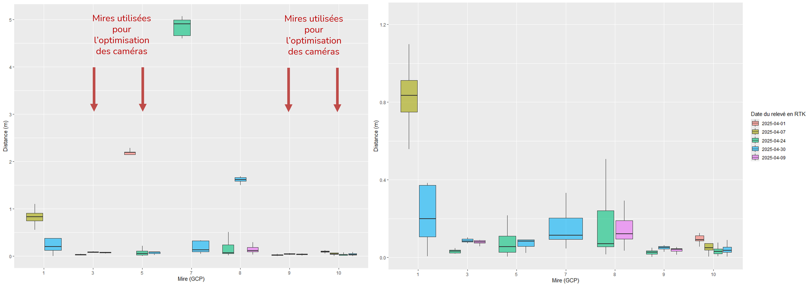

## Accès rapide
* [Questions](#questions)
* [Méthode](#methode)
* [Résultats](#resultats)
    - [Graphes](#graphes)
    - [Commentaires](#commentaires)
* [Conclusion](#conclusion)
    

## Questions
- Quelle est la précision des corrections géométrique en absolu (par rapport aux points relevés en RTK donc) ?

- Quelle est la précision des corrections géométriques en relatif (par rapport aux centroïdes de l’ensemble des positions photo-interprétées) ?

- Une co-registration est elle nécessaire ?

## Méthode 1 : Corrections en absolu

1. Production orthomosaïques sur l’ensemble de la série temporelle (Zone 1 et Zone 2)
    - Utilisation de tous les points RTK « valides » (i.e points surface plane non enfoncés dans la forêt) pour optimisation des caméras dans Metashape 
2. Relevés du centre de chaque mire dans chaque image (shapefile)
3. Calcul de la distance entre ces relevés images et tous les relevés RTK (terrain)
    - 5 relevés RTK existants en date du : 01 – 07 – 09 – 24 – 30 avril
    - Toutes les mires n’ont pas été relevées à chaque passage
4. Analyse graphique + table de la moyenne de ces distances
5. Filtrage valeurs aberrantes (problème de projection, images décalées dans leur ensemble etc.)
    - 01/05/2025 Z2S2 – Problème de projection sur le point 8 (pleine forêt)

## Résultats de la méthode 1
### Graphes

*Précision des corrections géométrique en absolu, avec et sans valeurs aberrantes*

### Commentaires
- En filtrant les valeurs aberrantes, la précision absolu des corrections géométriques est d'environ 21cm pour la zone 1 et de 7cm pour la zone 2
- En faisant la même chose pour la précision relative, cette dernière est bien meilleure : environ 12cm pour zone 1 et 4,5cm pour zone 2
- Dans tous les cas, les points utilisés pour optimiser la position des caméras sont biens meilleurs en précision

## Conclusion de la méthode 1

