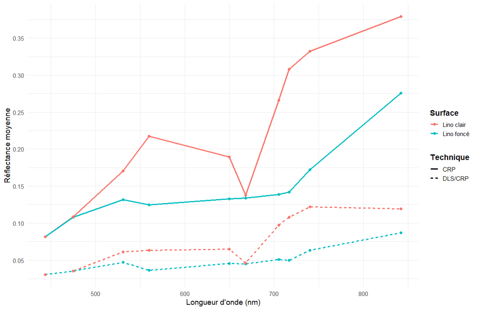
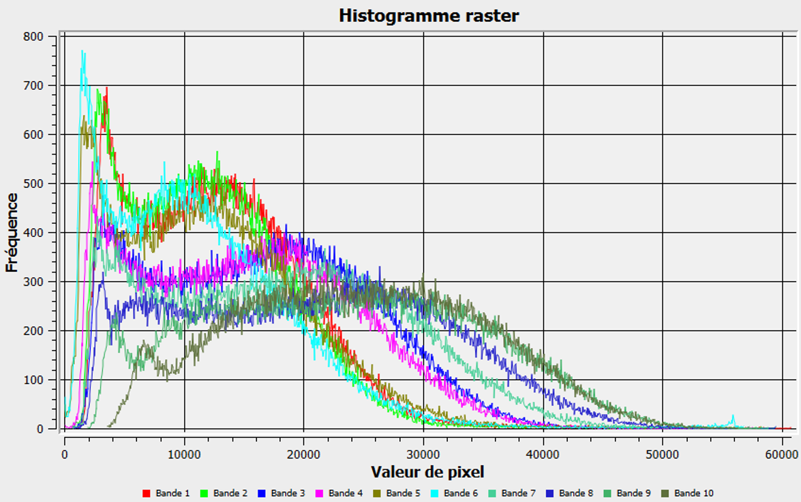
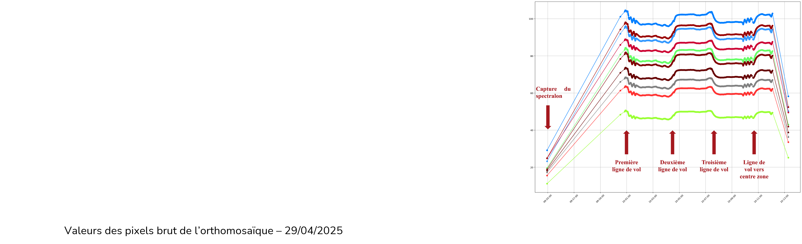
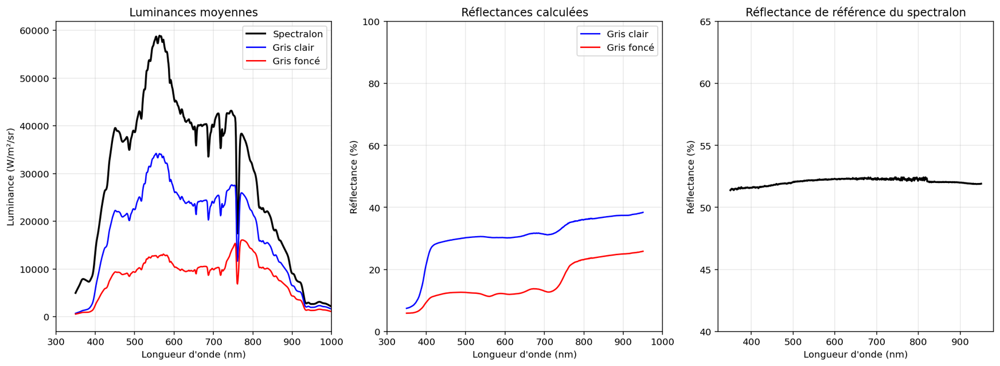
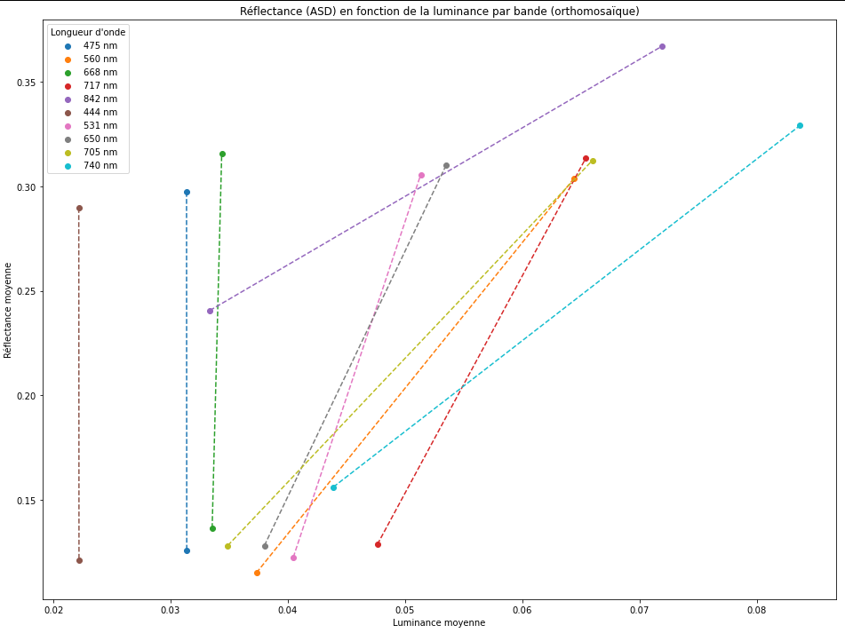
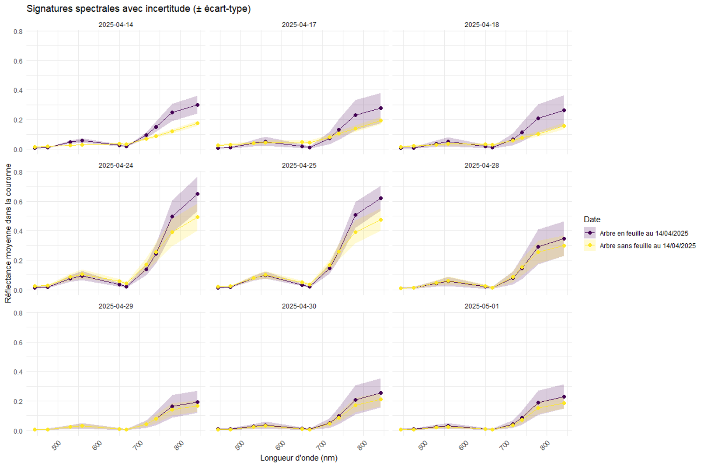
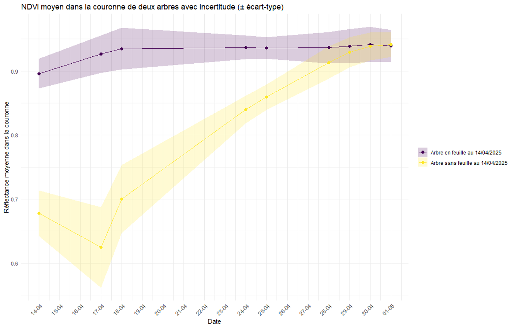

## Accès rapide
* [Questions](#questions)
* [Impact des méthodes de corrections radiométriques sur une date](#impact-des-méthodes-de-corrections-radiométriques-sur-une-date)
    - [Méthode 1 : Impact DLS/CRP](#méthode-1--impact-dlscrp)
        - [Résultats](#résultats-de-la-méthode-1)
        - [Conclusion](#conclusion-de-la-méthode-1)
    - [Méthode 2 : Impact ELM](#méthode-2--impact-elm)
        - [Résultats](#résultats-de-la-méthode-2)
        - [Conclusion](#conclusion-de-la-méthode-2)
* [Impact des méthodes de corrections radiométriques sur la série temporelle](#impact-des-méthodes-de-corrections-radiométriques-sur-la-série-temporelle)
    - [Méthode 3 : Impact série temporelle](#méthode-3--impact-série-temporelle)
        - [Résultats](#résultats-de-la-méthode-3)
        - [Conclusion](#conclusion-de-la-méthode-3)
    

## Questions
- Quelle est la précision des corrections radiométriques produites (DLS/CRP et ELM) ? ([Méthode 1](#methode-1) et [Méthode 2](#methode-2))
- Dans la série temporelle, existe-t-il une cohérence spectrale ? Est-elle utilisable dans l’état ?

## Impact des méthodes de corrections radiométriques sur une date
### Méthode 1 : Impact DLS/CRP
1. Production orthomosaïque du 29/04/2025 via Metashape en utilisant :
    - DLS + CRP avant et après le vol
    - DLS + CRP avant le vol
    - DLS + CRP après le vol
    - CRP avant le vol
    - CRP après le vol
2. Normalisation de chaque bande pour passer en valeur de réflectance (entre 0 et 1) et export en Lambert-93
3. Création de polygones au centre des linos des images et calcul de la valeur moyenne de réflectance dans chaque bande et pour chaque technique utilisée pour comparaison
4. Inspection des valeurs du DLS (luminance) pour voir si de potentiels problèmes pourraient venir de là 

### Résultats de la méthode 1
#### Graphes

*Valeurs de réflectance du 29/04/25 selon la technique utilisée*

*Valeurs des pixels brut de l’orthomosaïque – 29/04/2025*

*Valeurs d’éclairement du DLS – 29/04/2025*

#### Commentaires
- Différences notables de réflectance calculée dans Metashape entre DLS/CRP et CRP only
- Pas de saturation du capteur + données du DLS  normales 

### Conclusion de la méthode 1
* Des différences importantes existent entre les différentes méthodes utilisées
* Les images sont cohérentes par rapport à elles-mêmes MAIS le NDVI affiche des valeurs très élevées (surtout au sol) 
* Elles sont utilisables en l’état mais sûrement non comparables avec d’autres sources de données comme Sentinel-2 par exemple
* Ces résultats semblent démontrer un fort impact de la zone d’étude -> les données relevées sur le site de l’ONERA étant globalement plus cohérentes
    - La proximité d’arbres hauts bloquants la lumière incidente pourrait être en cause

### Méthode 2 : Impact ELM
Tentative de production d’une orthomosaïque le 29/04/2025 via ELM :
1. Récupération des données en luminance de l’ASD
    - Conversion en réflectance en se basant sur données connues du spectralon
    - Obtention du spectre de réflectance pour lino clair, lino sombre et spectralon
2. Passage des images brutes en luminance
3. Création de polygones au centre des linos des images et calcul de la valeur moyenne de luminance
4. Mise en relation de la luminance des images et réflectance issues de l’ASD + calcul des facteurs de conversion (ELM –> ax+b)

### Résultats de la méthode 2
#### Graphes

*Conversion des valeurs de l’ASD de luminance vers réflectance – 29/04/2025*

*Tentative d’ELM – 29/04/2025*

#### Commentaires
- Passage données ASD -> données normales et utilisables
- Luminances quasi-égales entre gris clair et gris foncé pour trois bandes -> impossible de déterminer des facteurs de conversion
- Pas d’alternatives (pour le moment) pour l’ELM

### Conclusion de la méthode 2
* Impossible de produire un ELM aux vues des luminances obtenues avec la méthode de conversion de Micasense
    - Capteurs diff -> autres conversion proposée par Mamaghani mais impossible à mettre en place
    - Lino p-ê pas assez diff et assez grands
* Possible de faire un « ELM » a posteriori en comparant réflectances obtenues avec DLS/CRP et réflectance calculée avec ASD

## Impact des méthodes de corrections radiométriques sur la série temporelle 
### Méthode 3 : Impact série temporelle
Tentative de production d’une orthomosaïque le 29/04/2025 via ELM :
1. Production d’orthomosaïques entre le 14/04/2025 et le 01/05/2025 (Z2S2) en DLS/CRP
2. Normalisation de chaque bande pour passer en valeur de réflectance (entre 0 et 1) et export en Lambert-93
3. Calcul du NDVI pour chaque date
4. Sélection de deux arbres – un en feuille au 14/04 et l’autre sans feuille à la même date – puis segmentation à la main des individus. Segmentation effectuée une fois sur 14/04/2025 (afin d’être restrictif sur les dates postérieures) et appliquée à toutes les autres images
5. Calcul de la valeur moyenne de réflectance et de NDVI pour chaque individu et chaque date 

### Résultats de la méthode 3
#### Graphes

*Comparaison de la signature spectrale de deux arbres - un en feuille au 14/04/2025 et un sans feuille à la même date*

*NDVI moyen pour deux arbres au cours de la série temporelle*

#### Commentaires
- Valeurs plus importantes le 24 et 25 avril  -> seuls jours dans cette série temporelle où le ciel était totalement couvert
- Signatures spectrales cohérentes avec augmentation progressive de la réflectance du NIR
- Variabilité du résultat est directement dépendante des effets d’ombre dans la canopée

### Conclusion de la méthode 3
* Malgré valeurs hautes de NDVI, les images et le NDVI semble cohérent d’une date à l’autre
* Sûrement utilisable en série temporelle mais très complexe à lié avec autre capteur (Sentinel-2) par exemple
* Possible de faire un ELM entre réflectance calculée et réflectance connue grâce à ASD pour recaler les données
    - Impliquerait de prendre ASD sur prochaines campagnes terrain OU surface lambertiennes/semi-lambertiennes

